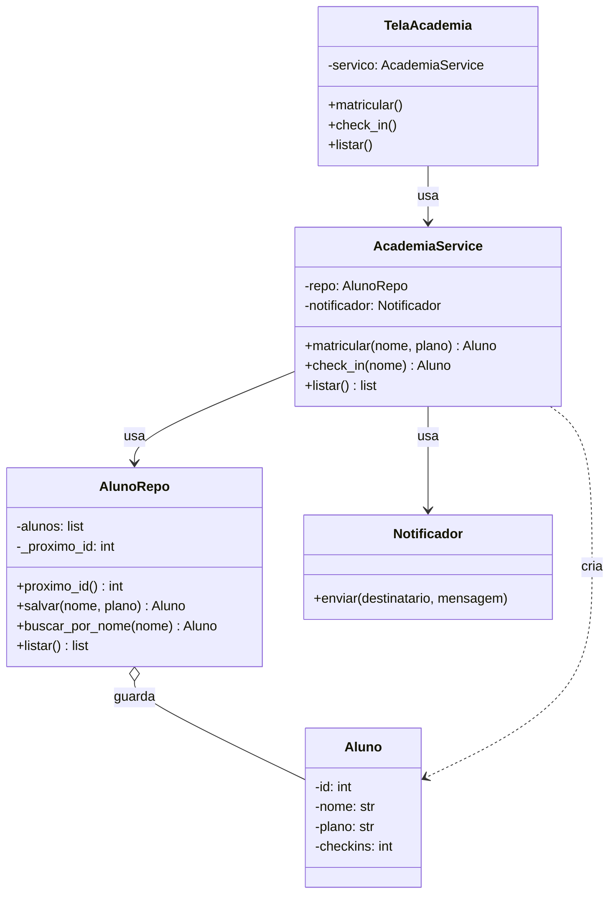

# Diagrama de classes — Academia FitPará (depois do SRP)

**Parte 1 da atividade (0,3):** diagrama de classes em **Mermaid** com a
decomposição em componentes. O GitHub renderiza Mermaid sozinho ao abrir o
arquivo no site.

**O que cada classe guarda/faz:**
- `Aluno` — os dados de um aluno (`id`, `nome`, `plano`, `checkins`). É uma **dataclass**.
- `AlunoRepo` — guarda e busca os alunos (salvar, buscar por nome, listar, próximo id).
- `Notificador` — envia o aviso ao aluno, sempre no formato `[WhatsApp para ...] ...`.
- `AcademiaService` — as **regras**: matricular (calcular o valor do plano — RN01), fazer check-in (RN02).
- `TelaAcademia` — a **tela** (menu, `input()`, `print()` de confirmação); usa o serviço.
